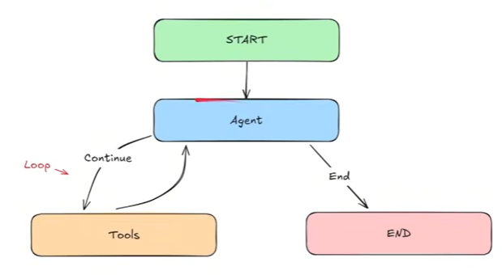
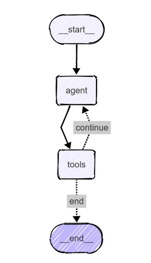

Created this repo while learning LangGraph. 

# LangGraph

Type annotations are very important. We use typedict to write classes with defined types. And there are options like 
Optional, Union, ..

- Dictionary
- Union, Optional, Any
- lambda function

------------------------
## Different elements in LangGraph

- State
- Node
- Graph
- Edges, Conditional Edges
- Start Node, end Node
- tools
- toolNode
- State Graph
- Runnable

## Different types of messages

Human message, AI message, System message, tool message, function message

## Graph 1

Main aim is to understand how data flows throgh a single node in langgraph.

### Hello World Graph
- Understand and define the AgentSTate structure.
- Create a simple node functions to process and update state.
- Set up a basic LangGraph structure.
- Compile and invoke a LangGraph graph.
- Understand how data flows through a single-node in LangGraph.
            
            | Start |--->(Node)--->| End |

## Graph 2
- More complex Agent State
- Create a processing node that performs operations on list data.
- Set up a LangGraph that processes and outputs computed results.
- Invoke the graph with structured inputs and retrieve outputs.
           
## Graph 3 - Sequential Graph
- Create multiple Nodes that sequentially process and update different part of the state.
- Connect Nodes together in a graph.
- Invoke the Graph and see how the state is transformed step-by-step
- **Main Goal:** Create and handle multiple Nodes.

## Graph 4 - Conditional Graph
- Implement conditional logic to route the flow of data to different nodes.
- Use start and end nodes to manage entry and exit points explicitly.
- Design multiple nodes to perform different operations (addition, subtraction).
- Create a router node to handle decision-making and control graph flow.
- **Main Goal:** How to use "add_conditional_edges()"

## Graph 5 - Looping Graph
- Implement looping logic to route the flow of data back to the nodes.
- Create a single conditional edges to handle decision-making and control graph flow.
- **Main Goal:** Coding up Looping Logic.

## Simple Bot
- Define state structure with a list of HumanMessage Objects.
- Initialize GPT-4o model using LangChain's ChatOpenAI. (used Llama, since it is free.)
- Sending and handling different types of messages.
- Building and compiling the graph of the Agent
- **Main Goal:** How to integrate LLMs in our Graphs.

## Chatbot
- Use different message types - HumanMessage and AIMessage.
- Maintain a full conversation history using both message types.
- Use GPT-4o model using LangChain's ChatOpenAI. (will use Llama)
- Create a sophisticated conversation loop.
- **Main Goal:** Create a form of memory for our Agent. 

## ReAct agent (Reasoning and Acting Agent)

- Learn how to create Tools in LangGraph.
- How to create a ReAct Graph.
- Work with different types of Messages such as ToolMessages.
- Test out robustness of our graph.
- **Main Goal:** Create a robust ReAct Agent!

Used gpt4.1 model, with developer token from github/marketplace/models (in chatbot.py, memory.py, ReAct.py)

## Drafter
- need to create an AI Agentic System that can speed up drafting documents, emails, etc. The AI Agentic System should have *Human-AI Collobration* meaning the Human should be able to provide *continuous feedback* and the AI Agent should stop when the Human is happy with the draft. The system should also be fast and be able to save the drafts.

