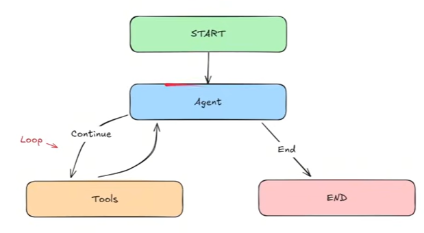

## Simple Bot
- Define state structure with a list of HumanMessage Objects.
- Initialize GPT-4o model using LangChain's ChatOpenAI. (used Llama, since it is free.)
- Sending and handling different types of messages.
- Building and compiling the graph of the Agent
- **Main Goal:** How to integrate LLMs in our Graphs.

## Chatbot
- Use different message types - HumanMessage and AIMessage.
- Maintain a full conversation history using both message types.
- Use GPT-4o model using LangChain's ChatOpenAI. (will use Llama)
- Create a sophisticated conversation loop.
- **Main Goal:** Create a form of memory for our Agent. 

## ReAct agent (Reasoning and Acting Agent)

- Learn how to create Tools in LangGraph.
- How to create a ReAct Graph.
- Work with different types of Messages such as ToolMessages.
- Test out robustness of our graph.
- **Main Goal:** Create a robust ReAct Agent!

Used gpt4.1 model, with developer token from github/marketplace/models (in chatbot.py, memory.py, ReAct.py)

## Drafter
- need to create an AI Agentic System that can speed up drafting documents, emails, etc. The AI Agentic System should have *Human-AI Collobration* meaning the Human should be able to provide *continuous feedback* and the AI Agent should stop when the Human is happy with the draft. The system should also be fast and be able to save the drafts.

- Hi